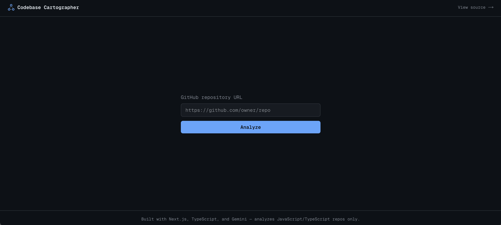
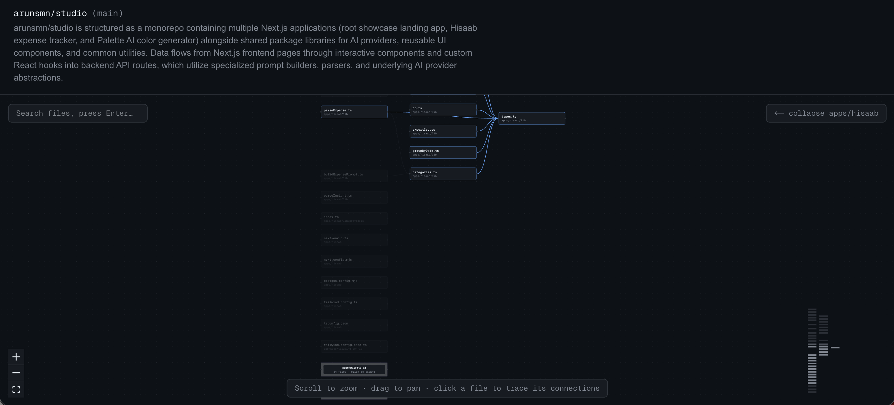

# Codebase Cartographer

Turns any public JavaScript/TypeScript GitHub repository into an accurate,
auto-generated dependency diagram — with an AI-narrated architecture summary
explaining how the codebase actually fits together.

**Live demo:** [codebase-cartographer-nu.vercel.app](https://codebase-cartographer-nu.vercel.app/)

## Screenshots

**Point it at a repo:**


**Get an accurate, navigable architecture diagram:**


## Why this exists

Understanding an unfamiliar codebase usually means clicking through files
one at a time, trying to reconstruct the architecture in your head. This
tool automates that: point it at a repo, and it shows you the real,
verified structure — which files import which — laid out as a diagram,
with a short AI-written summary of the overall design.

The core design principle, borrowed from how tools like [Chalk](https://chalk.app)
approach AI-generated diagrams: **the structure must be 100% correct,
generated by deterministic parsing — the AI only narrates on top of facts
that are already locked in.** Nothing about _which files connect to which_
is ever left to an LLM to guess.

## Features

- **Accurate dependency graphs** — parses real `import`/`export` statements
  via the TypeScript compiler (`ts-morph`), including `tsconfig.json` path
  alias resolution (`@/*`-style imports)
- **AI architecture summary** — a short, Gemini-generated overview of the
  codebase's structure, with a hallucination guard that filters out any
  reference to a file that doesn't actually exist in the repo
- **Search** — jump to any file by name, even inside a collapsed monorepo
  package
- **Click-to-trace connections** — click any file to highlight its direct
  dependencies and dependents, dimming everything else
- **Monorepo package grouping** — automatically detects genuine monorepo
  structure (`apps/`, `packages/`, `libs/`, `services/`) and collapses each
  package into an expandable group, so large monorepos stay readable
- **Minimap** — for orientation on large graphs

## Architecture

GitHub URL
│
▼
┌─────────────┐ ┌──────────────┐ ┌───────────────┐ ┌──────────────┐
│ Ingestion │──▶│ Parser │──▶│ Graph │──▶│ Narration │
│ (GitHub API) │ │ (ts-morph) │ │ (nodes/edges) │ │ (Gemini) │
└─────────────┘ └──────────────┘ └───────────────┘ └──────────────┘
│
▼
┌───────────────────┐
│ Layout + Render │
│ (dagre, client-side│
│ for live grouping) │
└───────────────────┘
Each stage lives in its own module under `src/core/`, with no dependency
on Next.js or React — the parser, graph builder, and narration agent could
be reused in a CLI tool tomorrow without any changes. See `docs/adr/` for
the specific design decisions behind this structure.

## Tech stack

- **Framework:** Next.js 16 (App Router), TypeScript, Tailwind CSS v4
- **Parsing:** `ts-morph` (TypeScript compiler API), `jsonc-parser`
- **Graph layout:** `@dagrejs/dagre`
- **Diagram rendering:** `@xyflow/react`
- **AI narration:** Google Gemini (`@google/genai`), with structured
  output validated by Zod and a hallucination-filtering guard
- **Validation:** Zod (environment config, API request bodies, narration
  schema)
- **Testing:** Vitest (38 unit tests over the deterministic core)
- **CI/CD:** GitHub Actions (lint, typecheck, test, build) with branch
  protection enforcing all checks before merge

## Getting started

```bash
git clone https://github.com/arunsmn/codebase-cartographer.git
cd codebase-cartographer
pnpm install
cp .env.local.example .env.local
# fill in GITHUB_TOKEN and GEMINI_API_KEY in .env.local
pnpm dev
```

Set `NARRATION_PROVIDER=mock` in `.env.local` to test the app without
calling Gemini (useful if you're rate-limited on the free tier).

## Known limitations

- **JavaScript/TypeScript repos only.** The parser is built on `ts-morph`.
  It's designed behind an interface so other languages (Python, Go, Java)
  could be added without touching the rest of the pipeline — just not
  built yet. See `docs/adr/0002-language-scope.md`.
- **Narration is structure-only**, not grounded in actual file contents —
  descriptions are inferred from file paths and the import graph, so they
  can occasionally be imprecise about a file's exact behavior. See
  `docs/adr/0001-structure-only-narration.md`.
- **Public repositories only** — the GitHub token is deliberately scoped
  to public, read-only access.
- **No rate limiting yet** on the analyze endpoint — a known gap, not yet
  addressed.
- **Not mobile-responsive** — this is a dense, interactive diagram tool;
  it's designed for a desktop screen.
- **Test coverage is unit-level only** — the deterministic core (parsing,
  grouping, graph building) is thoroughly unit-tested; there are no
  integration or end-to-end tests.

## License

MIT
